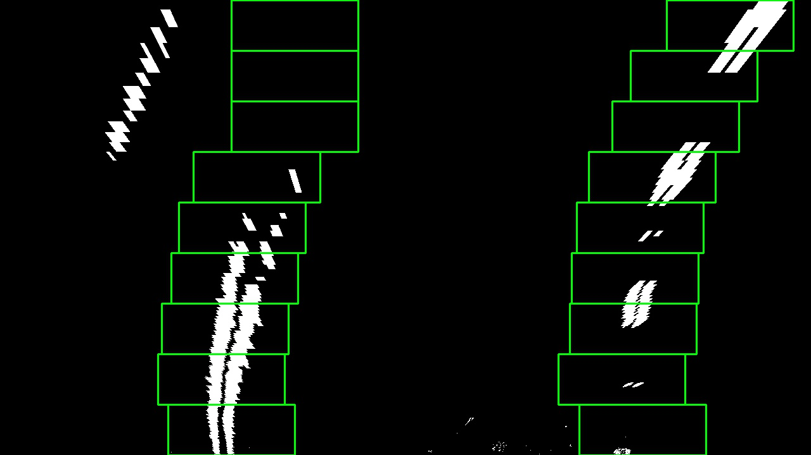
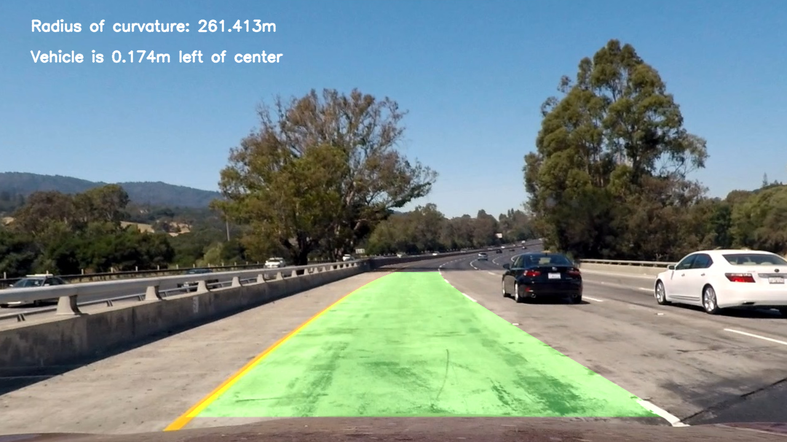
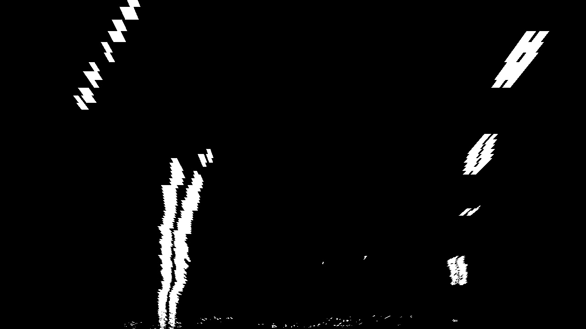
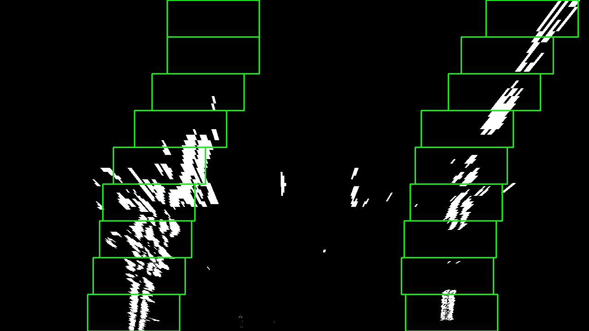

# Project: Advanced Lane Finding

## Table of Contents
1. [Overview](#overview)
2. [Camera Calibration](#camera-calibration)
3. [Image Projection](#image-projection)
4. [Binarization](#binarization)
5. [Warping](#warping)
6. [Finding Lanes](#finding-lanes)
7. [Image Results](#image-results)
8. [Video Result](#video-result)
9. [Discussion](#discussion)

Overview
---
The goal of this project is to find the lane lines reliably in different lighting conditions and to find the radius of curvature of the lanes.

Camera Calibration
---
Camera calibration is based on opencv camera calibration procedure of finding chess board corners. 20 images of chessboard are considered taken at different stand-off distance and different view angles.
Dimensions of the chess board is 9x6.
Some of the sample images

Camera calibration code can be found in the first code cell of the notebook.

Image Projection
---
To calculate the projection points, straight line images are used
Steps taken to calculate are:

* Undistortion
* Binarization
    * Extracting R and G channels from RGB colorspace and applying thresholds
    * Extracting S channel from HLS colorspace image and applying thresholds
    * Conversion to grayscale
    * Finding Gradient along x-direction
    * Combining
* Considering only ROI points
* Finding corners of the lane
* Transform the straight line images to make sure the projection is correct

Sample images for the above steps:

**R channel of the image:**

**G channel of the image:**

**R and G binary:** Threshold used are: `R > 150` and `G > 130`

**S channel:** Threshold is `100 < S < 200`

**Sobel gradient in x:** Threshold is `20` and `200`, kernel is `3`

**Combined image:** Adding up R and G binary, S binary and Gradient Binary

**ROI corner points:**
`[575, 443]`,
`[200, 680]`,
`[1100, 680]`,
`[725, 443]`

**Finding corner points of the lane:**

Locations of maximum values is searched along `443` and `680`. The highest and lowest locations are considered as corners for the projection

**Projected image**

Corner points of the transformation are written to the pickle file.

Binarization
---
For image and video the following steps are used for binarization:

* **Conversion to grayscale**:
Input image is converted to grayscale

* **Conversion to HLS colorspace**
Input image is also converted to HLS colorspace and S channel is extracted

* **Sobel gradient along x orientation**
Sobel gradient is calculated along x orientation for both grayscale image and s-channel. For grayscale image threshold used is `40` and `100` with kernel size of `3`.
For s channel the threshold used is `20` and `100` with kernel size of `7`.

Warping
---
Src. points for the warping are loaded from the pickle file dumped previously.

`src_points = [[  600., 443.],
 [  260., 680.],
 [ 1061., 680.],
 [  682., 443.]]`

 Dst. points are calculated based on the offset. 
I used `x offset` to be `320` and `y offset` to be `0`. From this Dst. points are calculated as:

` dst_points = [[x_offset, y_offset], 
    [x_offset, height-y_offset], 
    [width-x_offset, height-y_offset], 
    [width-x_offset, y_offset]]`

Finding Lanes
---
To find the lanes after binarization and warping, sliding window search is used. In case of images always full frame detection is carried out and in case of video only full frame detection is carried out for the first frame. In the subsequent frames the previous detected regions with some margin are searched for the lane. The results are stored in the `class Line`. 
To detect the line from the previous frames `best fit` coeffients are used obtained by averaging `10` history frames.

Results for all the above steps is mentioned [Image Results](#image-results) and [Video Result](#video-result) section.

Image Results
---
| Original Image | Undistorted image | Binary image | Warped Image | Lane Detected Image| Final Image |
|:--------------:|:------------:|:------------:|:-------------:|:-----------:|:------:|
|  |  |   |  |  | 
|  |  |  |  |  | 
|  |  |  |  |  | 
|  |  |  |  |  | 
|  |  |  |  |  | 
|  |  |  |  |  | 

Video Result
---

Discussion
---
The main challenge was to adjust the threshold values and to combine them to find lane lines more clearly and noise free.
All the thresholds for the gradient lane detections are hard coded. The process of lane detection can be improved with adaptive local thresholds rather than the global hard coded thresholds. In the algorithm currently there is no filtering to reject the noise. Some filtering techniques and morphological operations such as erosion and dilation can be applied to make the detection better.
Perspective projection points can be found out on multiple continuous images and average the points to find little better source points. 
Lanes near the vanishing points can be much more clearly identified and projected to find the better radius of curvature. 
Furthermore in difficult lighting conditions algorithm can be made to detect one of the lane and approximately predict the other and decide the radius of curvature.
